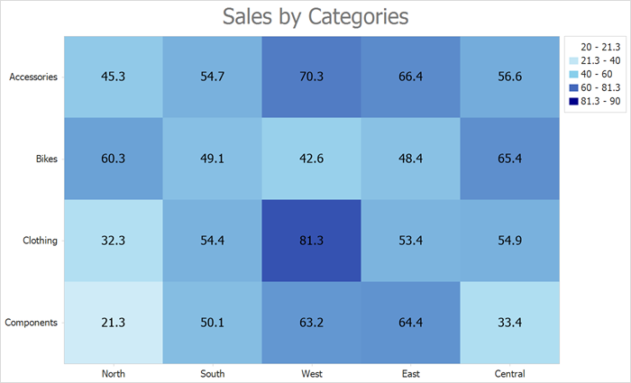

<!-- default badges list -->

<!-- default badges end -->

# How to Create a Heatmap Based on Arrays of String and Numeric Values

This example shows how to use string and numeric value arrays to create a heatmap.

To load array data to a heatmap, follow the steps below:

- Create a [HeatmapMatrixAdapter](https://docs.devexpress.com/CoreLibraries/DevExpress.XtraCharts.Heatmap.HeatmapMatrixAdapter) object. 

- Specify the following adapter properties:

    - [XArguments](https://docs.devexpress.com/CoreLibraries/DevExpress.XtraCharts.Heatmap.HeatmapMatrixAdapter.XArguments)
    - [YArguments](https://docs.devexpress.com/CoreLibraries/DevExpress.XtraCharts.Heatmap.HeatmapMatrixAdapter.YArguments)
    - [Values](https://docs.devexpress.com/CoreLibraries/DevExpress.XtraCharts.Heatmap.HeatmapMatrixAdapter.Values)

- Assign the adapter object to the [HeatmapControl.DataAdapter](https://docs.devexpress.com/WindowsForms/DevExpress.XtraCharts.Heatmap.HeatmapControl.DataAdapter) property.

<!-- default file list -->
## Files to Look At

- [Form1.cs](./CS/Form1.cs) ([Form1.vb](./VB/Form1.vb))

<!-- default file list end -->

## Documentation

- [HeatmapControl](https://docs.devexpress.com/WindowsForms/DevExpress.XtraCharts.Heatmap.HeatmapControl)
- [HeatmapMatrixAdapter](https://docs.devexpress.com/CoreLibraries/DevExpress.XtraCharts.Heatmap.HeatmapMatrixAdapter)

## More Examples

- [How to Create a Heatmap Chart Based on a Data Source](https://github.com/DevExpress-Examples/winforms-heatmap-bind-to-data-source)
